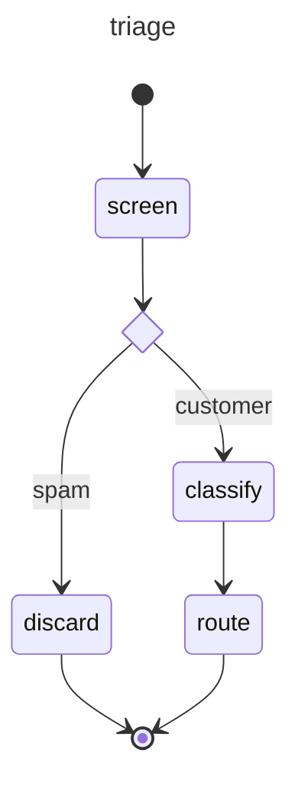

# e-jev

A self-hosted [Jev](https://docs.typesafe.ai): TypeSafe's System One API — typed, calibrated decisions
instead of text — served from your own GPU through vLLM. Wire-compatible with the official
`typesafe-sdk`, `@typesafe-ai/sdk` and the TypeSafe n8n node: point their base URL here.

No text is generated. Each question is one forward pass per option order; the exact logprobs of the
option letters (`logprob_token_ids`) are renormalized over your options, so nothing outside them can
win. The state prefix is shared across questions by vLLM's prefix cache. Confidence follows
TypeSafe's reference definitions.

## Services

| Service | Port | Unit | Role |
|---|---|---|---|
| vllm | 45100 | `vllm.service` | `cyankiwi/Qwen3.6-27B-AWQ-INT4` served as `qwen3.6-27b` |
| jev | 45160 | `jev.service` | System One API |
| n8n | 45700 | `n8n.service` | optional UI: official TypeSafe node wired to jev |
| phoenix | 45900 | `phoenix.service` | traces: every evaluation, question, readout and vLLM request, one trace |

Compose dirs live in `~/.config/compose/<service>`, data in `~/.config/compose/data/<service>`.

    make deploy    # build jev, install + enable + restart vllm and jev
    make ui        # n8n + official node + credential on jev + demo workflow
    make watch     # Phoenix: traces UI and OTLP sink for jev and vllm
    make status    # systemd + container health

## API

`POST /v1/systemone` — the TypeSafe contract: `state` (string, object or array), `model`, and a map of
questions of type `noul`, `choice` (≤26 options) or `score` (≤10 levels).

    curl -s localhost:45160/v1/systemone -H 'content-type: application/json' -d '{
      "state": "Help! My payouts have been failing for 3 days.",
      "model": "jev-latest",
      "questions": {
        "department": {"type": "choice", "instructions": "Which team should handle this?",
                       "criteria": {"billing": "Payments, invoicing, refunds", "technical": "Bugs, outages", "sales": "Pricing"}},
        "is_urgent":  {"type": "noul", "instructions": "Does this convey urgency?"},
        "frustration": {"type": "score", "instructions": "How frustrated is the customer?", "criteria": ["Calm", "Frustrated", "Very angry"]}
      }}'

`GET /v1/models` — `jev-latest` plus the served model. Any `model` in a request is answered by it.

`POST /v1/extract` — beyond Jev: typed values through Outlines. `{"state", "instructions", "schema"}`
→ JSON matching the schema.

Official SDK:

    from typesafe_sdk import Choice, TypeSafeClient
    client = TypeSafeClient(api_key="local", base_url="http://localhost:45160")

## Graphs

`examples/triage/graph.py` is a support-ticket triage built on Pydantic AI's TypeSafe model and
pydantic-graph: typed output models become System One questions (`bool` → noul, `StrEnum` of 30 areas →
choice, `IntEnum` with a docstring per level → score), and code routes on the answers. It runs unchanged
against e-jev or TypeSafe's Jev (`JEV_URL`).

    make graph "Our SAML login with Okta fails for every user"
    make integration      # the graph against the live endpoint, 6 cases

## Calibrate

    make calibrate labeled.jsonl

One System One question and its truth per line — the choice key, the score level index, or
`"true"`/`"false"` for a noul:

    {"state": "...", "question": {"type": "choice", "instructions": "...", "criteria": {"a": null, "b": null}}, "label": "a"}

Writes `calibration.json` (temperature, ECE before/after) and restarts jev, which applies it. A fit is
bound to the model and `JEV_PERMUTATIONS`; change either and jev ignores it until you refit.

## Tuning

vllm: `VLLM_MODEL`, `VLLM_SERVED_NAME`, `VLLM_GPU_UTIL` (0.93), `VLLM_MAX_MODEL_LEN` (16384), `VLLM_MAMBA_BLOCK` (256),
`VLLM_KV_DTYPE` (fp8), `VLLM_MAX_SEQS` (16), `VLLM_MAX_BATCHED` (2048), `VLLM_API_KEY`.
jev: `JEV_PERMUTATIONS` (1; 2 asks both option orders, removing position bias at ~2x cost),
`JEV_CONCURRENCY` (16), `JEV_API_KEY` (unset accepts any bearer key), `JEV_TRIE_EPSILON` (1e-4),
`JEV_OTLP_ENDPOINT` (unset disables tracing).

## Differences from Jev

- Choice above 26 options reads numbered labels through a token trie, best-first within a total-variation budget
  `JEV_TRIE_EPSILON` (1e-4; 0 is exact). 255 options take ~3.5 s on one RTX 4090; ≤26 is a single pass.
- `usage.output_tokens` counts forward passes, one per question and option order.
- Probabilities come from a general instruct model, uncalibrated until you run `make calibrate`.
