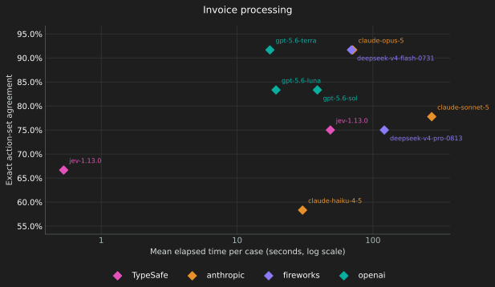
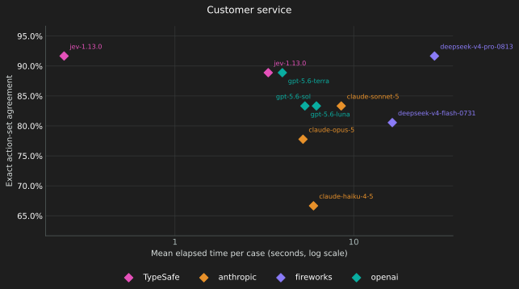
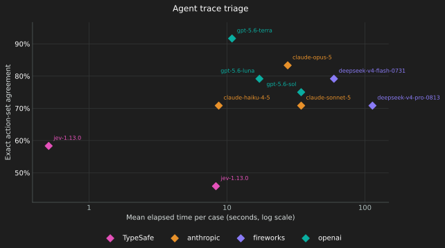
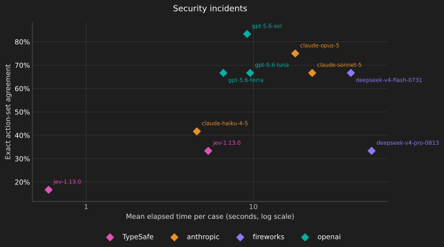

# WorkflowEvals: e-jev against Jev

TypeSafe's own benchmark ([WorkflowEvals](https://github.com/typesafe-ai/WorkflowEvals), pinned at
`0ac3b8a`), run against e-jev through its `--base-url` override and scored with its own code against the
runs TypeSafe publishes on Hugging Face — Jev 1.13 and eight LLMs — on the same cases.

- **e-jev** `cyankiwi/Qwen3.6-27B-AWQ-INT4` on one RTX 4090, vLLM 0.30.0.
- **Sample** the first 12 cases of each workflow (48 of 705). Agreement with the consensus reference label.
- **Reproduce** `make evals` (`EVALS_LIMIT=12` by default).

| Workflow | Metric | v1 | v2 | Jev 1.13 | best LLM | v1 s/case | v2 s/case | Jev s/case |
|---|---|---|---|---|---|---|---|---|
| invoice_processing | exact actions | 0.750 | 0.694 | 0.667 | 0.917 | 48.6 | **32.0** | 0.53 |
| customer_service | exact actions | 0.889 | 0.889 | 0.917 | 0.917 | 3.3 | 3.3 | 0.24 |
| agent_trace_observability | primary action | 0.458 | 0.458 | 0.583 | 0.917 | 8.3 | **7.4** | 0.51 |
| security_incidents | exact actions | 0.333 | 0.250 | 0.167 | 0.833 | 5.4 | **2.4** | 0.60 |
| mean | | 0.608 | 0.573 | 0.583 | | | | |

- **v1** (2026-10-01): fp32 recurrent state, uncalibrated.
- **v2** (2026-10-01): bf16 recurrent state, per-kind temperatures fitted on BoolQ / AG News / Banking77 / SST-5.

## Reading it

- **Quality: on par with Jev, iteration to iteration and against it.** Every workflow differs by at most one
  or two cases out of twelve, in both directions; at n = 12 that is noise, not a ranking. Both e-jev and
  Jev trail the best LLMs, which reason over the whole case — the price of a decision model.
- **What moved between v1 and v2, traced to its cause.** invoice_processing lost one case to bf16: a noul at
  p = 0.52 crossed to 0.44 (measured drift vs fp32: mean |Δp| 0.0009, p95 0.0066). security_incidents
  compares probabilities with thresholds; the BoolQ-fitted temperature (2.46) pulls them toward 0.5
  (0.879 → 0.692) and moved seven decisions — three better, two worse, two still wrong. Calibration is
  fitted to the data it saw; thresholds tuned to Jev's calibration move with it.
- **Speed: v2 is 11–56 % faster than v1, still 10–60× slower than Jev.** Prefill runs at ~2,450 tokens/s,
  which is this 27B's compute ceiling on a 4090 (≈135 TFLOPs); the prefix cache already serves 87 % of the
  tokens. What remains is each question's own tokens. Jev runs on TypeSafe's cluster.
- **Cost**: usage counts the state once per request, as TypeSafe bills; the harness's estimates use Jev's
  price list and are meaningless for a local GPU.

Agreement against time per case, published runs and e-jev's:

